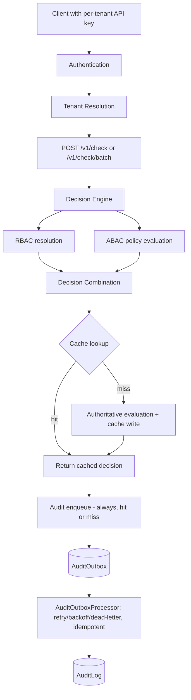

# Ledger-Lock

Ledger-Lock is a multi-tenant **Authorization-as-a-Service** backend: a
standalone service that answers "can subject X perform action Y on
resource Z, under context C, within tenant T?" for other applications,
via a REST API secured by per-tenant API keys.

It combines:

- **API-key authentication** with HMAC-based secret hashing and pepper rotation
- **Multi-tenant isolation** enforced at the query level, not just the controller level
- **RBAC** with hierarchical roles (cycle-checked, recursive-CTE permission resolution)
- **ABAC** via a small, closed, non-Turing-complete policy condition language (no `eval`, no arbitrary code execution)
- **Deterministic RBAC + ABAC decision combination**, with deny-by-default and deny-overrides-allow as structural (not incidental) properties
- **Version-aware Redis decision caching**, with an ABAC-safe cache key (not just `user + resource + action`)
- **A durable, asynchronous audit pipeline** using the transactional outbox pattern, with retry/backoff/dead-lettering and idempotent processing
- **Batch authorization** with N+1-avoiding query batching

## Current Status

**Phases 1–6 implemented, plus a post-freeze adversarial security audit and hardening pass.** This is not a scaffold — the authorization engine, caching layer, and audit pipeline described below are all real, tested code.

Implemented:

- Tenant + API-key authentication, with dual-pepper rotation support
- Full multi-tenant isolation (including defense-in-depth at the RBAC join-table query level, not just service-layer checks)
- RBAC: users, roles, permissions, hierarchical role inheritance with cycle prevention
- ABAC: a versioned policy engine (immutable policy versions, never overwritten) with a six-operator condition language
- A documented, deterministic RBAC+ABAC combination algorithm (see [ADR-010](docs/decisions/ADR-010-rbac-abac-interaction.md))
- Redis-backed decision caching with tenant/user authorization-version invalidation and an ABAC-safe attribute-hash cache key (see [ADR-012](docs/decisions/ADR-012-phase6-decision-cache.md))
- An audit outbox pipeline (enqueue → process → durable log), decoupled from the authorization response path
- `POST /v1/check` and `POST /v1/check/batch` authorization endpoints
- Full management APIs for tenants, users, roles, permissions, and policies

**Verified in this environment:**

- **459 automated tests passing**
- TypeScript strict-mode typecheck: passing
- ESLint (zero warnings): passing
- Production build: passing

**NOT verified in this environment** (see [Environment Limitations](#environment-limitations) below — this is a real, disclosed constraint, not an oversight):

- Execution against real PostgreSQL or Redis
- Real latency/throughput benchmarks
- Production deployment
- Continuous integration (no CI pipeline exists yet)

## Architecture Overview



Text equivalent, for anything that doesn't render Mermaid:

```text
Client (with a per-tenant API key)
  ↓
Authentication (API-key hash verification, tenant resolution)
  ↓
Tenant Context (every downstream query is scoped by this, never client-supplied)
  ↓
POST /v1/check or /v1/check/batch
  ↓
Decision Engine
  ├── RBAC resolution (role hierarchy → effective permissions, recursive CTE)
  ├── ABAC policy evaluation (versioned policies, condition evaluation)
  ├── Deterministic decision combination (deny-overrides-allow)
  ├── Version-aware Redis cache (lookup on entry, write on miss)
  └── Audit enqueue (always, regardless of cache hit/miss)
        ↓
   AuditOutbox (durable, transactional-outbox pattern)
        ↓
   AuditOutboxProcessor (retry, backoff, dead-letter, idempotent)
        ↓
     AuditLog
```

See [`docs/architecture.md`](docs/architecture.md) for the full write-up, and [`docs/decisions/`](docs/decisions) for the individual ADRs behind each major choice.

## Key Engineering Decisions

1. **Deny by default, structurally.** The decision engine has no implicit-allow branch — every path either names a specific ALLOW reason (`role_permission`, `policy_allow`) or falls through to DENY. This is enforced by code shape, not by convention, and is directly tested.
2. **Redis is never the source of truth.** Every Redis failure mode (connection error, timeout, malformed JSON, wrong-shaped data) collapses to "treat as cache miss" and falls through to the authoritative PostgreSQL-backed evaluator. A cache *write* failure never turns an already-correct decision into an error response.
3. **Version-aware cache invalidation, not TTL-only.** `Tenant.authzVersion`/`User.authzVersion` are atomic counters baked into the cache key; an authorization-affecting mutation makes every previously cached decision permanently unreachable (never explicitly deleted — just never looked up again), rather than relying on a short TTL to eventually paper over staleness.
4. **ABAC-safe cache keys.** Because policies can reference arbitrary caller-supplied `resource`/`context` attribute *values* Ledger-Lock doesn't own, the cache key includes a canonical (key-sorted) hash of that payload — not just a resource ID — so two requests for "the same resource" with different attributes never collide in the cache.
5. **Transactional audit outbox.** Authorization responses never wait on the audit log write; a decision is enqueued to `AuditOutbox` synchronously (cheap, single-row) and drained asynchronously by an idempotent, backoff-and-dead-letter-aware processor.
6. **Ports and adapters, applied narrowly.** Every Prisma-touching file is isolated behind one repository-port interface per bounded context, so the authorization/cache/audit logic is fully unit-testable without a database — at the cost of that persistence layer itself remaining unverified until real infrastructure is available (see Limitations).
7. **Honesty over polish.** Open risks (unauthenticated tenant bootstrap, ABAC role-inheritance gaps, an unwired audit scheduler) are tracked in a living risk register instead of being fixed with a speculative, unrequested feature — see [Current Limitations](#current-limitations).

## Engineering Challenges

A few specific problems worth highlighting, because the process of finding and reasoning through them is more informative than the final code:

1. **Cache correctness for ABAC, not just RBAC.** The original cache-key design (keyed on resource *identity*) was correct for RBAC-only decisions but silently unsafe once ABAC could evaluate arbitrary attribute *values* on that same resource. Closing this required adding a canonicalized attribute hash to the key — and explicitly rejecting a "smarter" alternative (only hash attributes a policy actually reads) as unnecessary complexity for the actual risk involved.
2. **A correctness bug found before it could matter.** `Tenant.authzVersion`/`User.authzVersion` existed in the schema from the start but were never actually incremented by any RBAC/policy write path — a gap that would have made version-based cache invalidation silently do nothing. This was found by auditing the existing code *before* building the cache on top of it, not discovered afterward.
3. **Keeping two implementations of "effective role" honest with each other.** Role-hierarchy cycle prevention uses a pure, database-free graph algorithm; the actual permission-resolution hot path uses a PostgreSQL recursive CTE for efficiency at scale. Both have to agree on semantics, so the pure algorithm's test suite is treated as the executable specification the SQL has to match.
4. **A real crash found by deliberate adversarial self-review.** A `resource: null` request body passed DTO validation (class-validator treats `null` and `undefined` identically for `@IsOptional()`) and then hit an unguarded property access, throwing an unhandled exception. Found by empirically reproducing a suspected gap with a throwaway test rather than assuming it was fine, then fixed and regression-tested.
5. **Tracing a suspected race instead of assuming the worst (or the best).** A version-read-then-evaluate ordering looked, at first glance, like it might let a stale decision get cached under a soon-to-be-superseded key. Tracing the actual write-then-bump ordering in every RBAC/policy write path showed the single-request case is safe; the batch case (which reuses one version read across up to 50 items) is not fully safe and is now explicitly documented as a bounded, accepted trade-off rather than either silently ignored or over-fixed.
6. **Leaving things open on purpose.** Three risks (unauthenticated tenant bootstrap, ABAC not reflecting inherited roles, no audit-outbox scheduler) were repeatedly *not* closed, each time because the available options were either "invent unrequested infrastructure to make a checkbox look green" or "leave it honestly open with a clear resolution path." The register documents the reasoning for each, not just the status.

## The Authorization Model

### RBAC

Users hold roles; roles hold permissions (`resource:action` strings, e.g. `invoices:delete`); roles can inherit from other roles, forming a DAG. Cycle creation is rejected at write time using a pure graph algorithm (tested independently of any database), and the actual permission-resolution hot path uses a PostgreSQL recursive CTE rather than loading the role graph into application memory. Every RBAC table is tenant-scoped, including defense-in-depth at the join-table write level (a cross-tenant role/permission assignment is rejected by the query itself, not only by an application-level check).

### ABAC

Policies are declarative JSON — never executable code. Each policy has immutable, versioned content (creating a "new version" never overwrites history) and a small set of six operators (`equals`, `not_equals`, `in`, `not_in`, `contains`, `starts_with`) with explicitly documented semantics, including how missing attributes and type mismatches are handled (see [ADR-009](docs/decisions/ADR-009-policy-language-semantics.md)). Conditions reference `subject.*`, `resource.*`, and `context.*` attributes through a whitelist resolver — there is no code path capable of arbitrary property access.

### Decision Combination

RBAC and ABAC are evaluated independently and combined by one pure function with a fixed six-cell table (see [ADR-010](docs/decisions/ADR-010-rbac-abac-interaction.md)):

| RBAC allowed | ABAC decision | Result | Reason |
|---|---|---|---|
| false | deny | DENY | `policy_deny` |
| true | deny | DENY | `policy_deny` |
| true | allow | ALLOW | `role_permission` |
| true | no_opinion | ALLOW | `role_permission` |
| false | allow | ALLOW | `policy_allow` |
| false | no_opinion | DENY | `no_matching_permission` |

An ABAC deny always overrides an RBAC allow. An ABAC allow can grant access even where RBAC alone would deny (this is what makes resource-ownership conditions like "the owner of this invoice may update it" work without a blanket role grant).

## Decision Caching

The cache key is **not** a naive `user + resource + action` key. Because ABAC conditions can depend on arbitrary caller-supplied `resource`/`context` attribute *values* that Ledger-Lock doesn't own or store, the key is:

```text
authz:{tenantId}:{tenantAuthzVersion}:{userId}:{userAuthzVersion}:{action}:{resourceType}:{resourceId}:{attributesHash}
```

- **`tenantAuthzVersion`** — bumped on any tenant-wide authorization change (role/permission definitions, role inheritance, any policy write). A policy or RBAC change makes every previously cached decision for that tenant unreachable, not merely stale.
- **`userAuthzVersion`** — bumped only when that specific user's role assignments change, so a role change for one user doesn't invalidate the whole tenant's cache.
- **`attributesHash`** — a truncated SHA-256 of the canonicalized (key-sorted) `{resource, context}` payload. Without this, two requests for the same `resourceId` but different attribute values (e.g. an invoice changing owners) could incorrectly share a cache entry.

**Redis is never the source of authorization truth.** Every failure mode — connection error, timeout, malformed JSON, a well-formed-but-wrong-shaped cached value — is treated identically as a cache miss, falling through to full authoritative RBAC+ABAC evaluation against PostgreSQL. A failed cache *write* never turns an already-correct decision into an error response. Only `{allowed, reason}` is cached — never policy-match provenance, since provenance can go stale independently of the boolean it produced (see [ADR-012](docs/decisions/ADR-012-phase6-decision-cache.md)).

A documented, accepted trade-off: a batch of checks fetches `tenantAuthzVersion`/`userAuthzVersion` once for the whole batch rather than per item, to avoid N+1 queries. This creates a bounded staleness window (scoped to one in-flight batch call) if a mutation commits mid-batch — explicitly documented in ADR-012's Decision 7, not silently accepted.

## Audit Pipeline

Every authorization decision — cache hit or miss — is enqueued to `AuditOutbox` (a single indexed insert) without blocking or ever failing the authorization response; an enqueue failure is logged and swallowed, never surfaced as an authorization error. A separate `AuditOutboxProcessor` drains the outbox into `AuditLog`, using:

- **Idempotency**: an upsert keyed by `sourceOutboxId`, so reprocessing after a crash never produces a duplicate log row
- **Crash-safe ordering**: the durable log write happens before the outbox row is marked processed
- **Exponential backoff** and **dead-lettering** after a bounded number of attempts

Cache-hit audit records honestly report `servedFromCache: true` with no fabricated policy-match detail — a cache hit's provenance was never recomputed, and the audit record says so rather than presenting stale data as fresh.

**Known incomplete piece:** nothing in this repository currently schedules `AuditOutboxProcessor.processBatch()` on an interval — see [Current Limitations](#current-limitations) (R-008).

## Security Design

- **Deny-by-default** is structural in the decision engine: every code path either names a specific ALLOW reason or falls through to DENY — there is no implicit-allow branch.
- **Tenant isolation** is enforced by deriving `tenantId` exclusively from the authenticated API key (never the request body), and by requiring `tenantId` as an explicit parameter on every tenant-scoped repository method.
- **API keys** are never stored raw — only an HMAC-SHA256 hash (with a server-side pepper, deliberately not bcrypt/argon2 — see [ADR-006](docs/decisions/ADR-006-api-key-hashing.md)) is persisted, and pepper rotation is supported via a dual-pepper verification window.
- **The policy language cannot execute code** — a closed, six-operator condition set with a whitelist attribute resolver, no `eval`, no `new Function`, no dynamic code generation of any kind (verified by direct source grep, not just by design intent).
- The project underwent an **adversarial internal security audit** after Phase 6, which found and fixed one real input-validation bug (`resource: null` crashing to a 500) and traced two suspected race conditions to ground — one confirmed safe, one confirmed real and bounded, both documented in ADR-012.

Security behavior is covered by automated tests and explicit architectural safeguards; real infrastructure validation (the actual Postgres/Redis behavior under load or attack) remains environment-dependent and has not been performed — see below.

## Current Limitations

Ledger-Lock maintains an explicit [risk register](docs/risk-register.md) rather than treating known gaps as invisible. These are engineering boundaries, not oversights — each has a documented reason and a resolution path:

- **R-001** — `POST /v1/tenants` (tenant bootstrap) is unauthenticated by necessity (a new tenant has no key yet). It's rate-limited (5/hour/IP) but not authenticated — a real, disclosed production blocker, not a secret one (see [ADR-008](docs/decisions/ADR-008-unauthenticated-tenant-provisioning.md)).
- **R-006** — ABAC's `subject.roles` reflects only a user's *directly* assigned roles, not roles gained through inheritance. Deliberately deferred rather than adding a query to the authorization hot path speculatively.
- **R-008** — the audit outbox processor has no scheduler wired to it yet (see Audit Pipeline above).
- Real PostgreSQL execution has not been verified in this development environment.
- Real Redis execution has not been verified in this development environment.
- Real latency/throughput benchmarks have not been measured — none are claimed anywhere in this repository.
- No CI pipeline currently exists.

The full register also tracks which pieces of Prisma/PostgreSQL-touching code have never executed against real infrastructure (R-004, R-005, R-007, R-009) — see below.

## Environment Limitations

This project was built and verified inside a sandboxed environment with **no outbound access to `binaries.prisma.sh`** (Prisma's engine-binary host) and **no Docker daemon available**. Concretely, this means:

- `npx prisma generate` cannot complete — `new PrismaClient()` throws immediately in this environment. No file in this repository that touches Prisma has ever executed against a real database here.
- No PostgreSQL or Redis instance has been reachable during development.
- No `prisma/migrations` directory exists yet — the schema has never been migrated anywhere.
- All "tests passing" claims refer to unit tests against mocked repository ports, not integration tests against real infrastructure.

One specific, verified data point: `npm run seed` was confirmed to run all the way through its TypeScript compilation and execute its actual logic (tenant lookup, then the first `new PrismaClient()` call) before stopping at the Prisma-generation limitation above — i.e. the *script itself* is confirmed correct up to the exact infrastructure boundary, not blocked by anything in its own code.

**On a machine with normal network access and Docker, this is expected to work as designed** — the code was written and reviewed as if it would run against real Postgres/Redis, and every Prisma-touching file is isolated behind a repository-port interface specifically so the rest of the codebase could be fully tested without it. But that expectation has not been empirically confirmed, and this README will not claim otherwise.

## Testing

**459 automated tests**, covering (non-exhaustively):

- API-key generation, hashing, verification, and pepper rotation
- Tenant isolation (explicit cross-tenant-access-denial tests for every tenant-scoped entity)
- RBAC: role hierarchy cycle detection, effective-permission resolution, join-table tenant guards
- ABAC: every operator's documented edge cases (missing attributes, type mismatches, case sensitivity), condition validation, policy versioning immutability
- The full RBAC+ABAC decision combination matrix (all six cells)
- Cache-key isolation and determinism (tenant/user/action/resource/attribute dimensions; canonicalization of nested objects, arrays, booleans, numbers, null)
- End-to-end cache-invalidation tests using a real in-memory cache implementation and the real cache-key builder — not just asserting a mock was called
- Redis failure modes (connection error, timeout, malformed data) always falling back to authoritative evaluation
- Audit enqueue, retry, backoff, dead-lettering, and idempotent reprocessing
- Input-validation edge cases (including a regression test for the `resource: null` crash found during adversarial audit)

These are unit and in-memory-integration-style tests against mocked persistence ports — **not** tests against a real running PostgreSQL or Redis instance (see Environment Limitations above). No code-coverage percentage is claimed, since no coverage report has been generated.

## Try It

### Required locally (needs Docker + network access to Prisma's binary host)

```bash
cp .env.example .env
npm install
npm run docker:up          # starts Postgres + Redis
npm run prisma:generate
npm run prisma:migrate
npm run seed
npm run dev
```

`npm run seed` creates two tenants (`acme`, `globex`), each with an API key (printed once to the console), a demo user (`demo-user`), a role (`Member`) granting `documents:read`, and that role assigned to the demo user — enough to exercise a real ALLOW decision immediately:

```bash
curl -X POST http://localhost:3000/v1/check \
  -H "Authorization: Bearer <the API key printed by npm run seed>" \
  -H "Content-Type: application/json" \
  -d '{"userId": "demo-user", "action": "documents:read"}'
```

Expected response: `{"allowed": true, "reason": "role_permission"}`.

Swagger UI is available at `http://localhost:3000/docs` once the server is running.

### Blocked in this evaluation environment

The steps above from `npm run prisma:generate` onward cannot complete here — see [Environment Limitations](#environment-limitations). Everything before that point (`npm install`, and every command in the [Verification](#verification) section below) runs and passes in this environment today.

## Verification

```bash
npm run typecheck
npm run lint
npm run build
npm test           # unit tests — no infrastructure required
npm run test:e2e   # requires docker:up first — real Postgres + Redis, no mocks
```

## Repository Layout

```text
ledger-lock/
├── apps/
│   ├── api/              # the Ledger-Lock service (NestJS)
│   ├── project-demo/     # not yet implemented (planned reusable-infrastructure demo)
│   └── invoice-demo/     # not yet implemented (planned reusable-infrastructure demo)
├── packages/
│   └── sdk/              # not yet implemented (TypeScript client SDK)
├── prisma/               # schema.prisma (no migrations generated yet — see Environment Limitations)
├── docker/                # Dockerfiles
├── docs/
│   ├── architecture.md    # full system design write-up
│   ├── risk-register.md   # authoritative list of open/resolved risks
│   └── decisions/         # ADRs — the reasoning behind individual design choices
└── scripts/                # seed.ts
```

## Documentation

- [`docs/architecture.md`](docs/architecture.md) — the full system design, one coherent narrative
- [`docs/decisions/`](docs/decisions) — ADRs for individual decisions (policy language, RBAC/ABAC interaction, versioning, caching, tenant isolation, API-key hashing, and more)
- [`docs/risk-register.md`](docs/risk-register.md) — the authoritative, actively-maintained list of open and resolved risks
